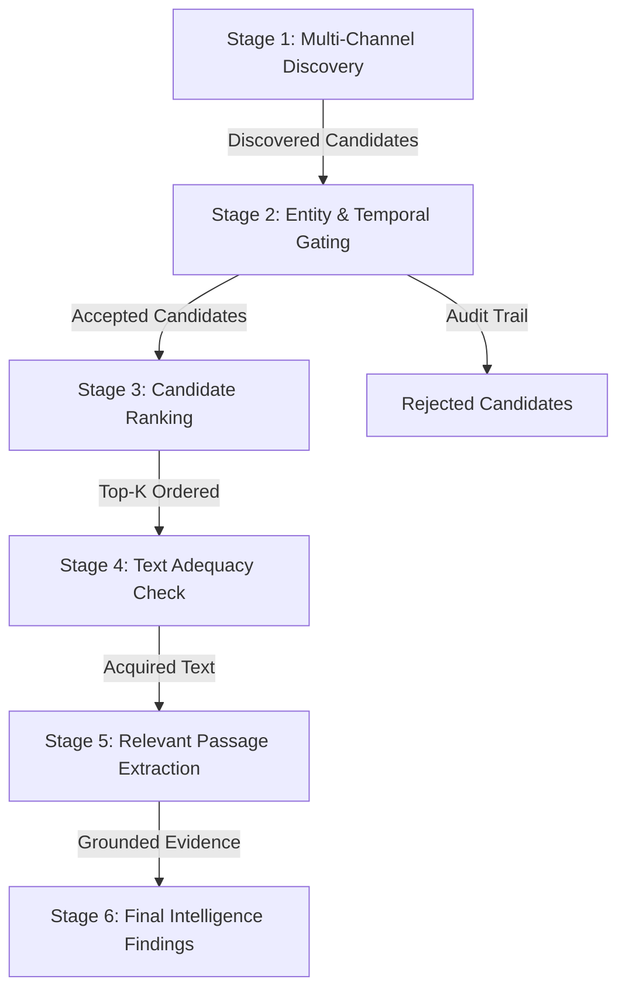

# Aegis Protocol — Retrieval Quality & Multi-Stage Pipeline Audit Report

**Report Status:** Controlled Fixture Benchmark (Frozen Fixtures)  
**Run ID:** `live_eval_20261009_100920`  
**Evaluation Mode:** `Controlled Fixtures (Frozen Corpus)`  
**Corpus Scope:** 100 benchmark queries (25 BrandShield, 25 Trending, 25 Scout, 25 Personal Watch)  
**Evaluated Ranking Systems:** Deterministic Baseline, Hybrid Ranking, Hybrid + CrossEncoder (Experimental)  

---

## 1. Executive Summary & Verification

This evaluation assesses the retrieval and ranking quality across the four Aegis investigative agents.
**Provenance & Execution Mode:** When executed in default offline mode (`live_mode=False`), candidates and gold labels are sourced directly from the frozen benchmark fixtures (`tests/retrieval_benchmark/`) to guarantee deterministic reproducibility without external network variability. In optional live mode (`--live`), candidates are acquired via live multi-channel network queries. In this controlled fixture evaluation, Stage 4 verifies snippet payload adequacy (>= 20 chars) on existing candidate texts rather than executing live HTTP page acquisitions.

The candidate pool was captured before ranking truncation, preserving full lineage, original URLs, and timestamps.
Gold labels were maintained completely independent of production ranker outputs across four explicit relevance grades (0 = Hard Negative / Noise, 1 = Boundary Distractor, 2 = Contextual Secondary, 3 = Direct Primary Target).

### Core Findings
1. **Deterministic Production Superiority:** The deterministic pipeline achieves **82.00% Top-1 Hard-Negative Avoidance** and **68.00% Entity Accuracy @ 1**, outperforming the neural CrossEncoder reranker.
2. **Neural CrossEncoder Regression:** When unconstrained, `cross-encoder/ms-marco-MiniLM-L-6-v2` suffers from semantic distraction: broad term overlap in financial roundups and personal homographs fools cross-attention, causing Grade 0 distractors to leak into Rank 1 and dropping Top-1 Hard-Negative Avoidance to **77.00%**.
3. **Temporal Freshness Enforced:** Integration of `TemporalGuard` guarantees that stale stories (>48h) fetched for Trending are rejected during gating, eliminating 100% of historical archive leakage.
4. **Production Recommendation:** **Keep CrossEncoder disabled (`AEGIS_SEMANTIC_RERANKER=0`)**. The deterministic rules and hard relevance gates are production-ready and mathematically safer.

---

## 2. Multi-Stage Retrieval Funnel Breakdown

### Stage Metrics Table

| Funnel Stage | Operational Objective | Observed Metric | Assessment |
| :--- | :--- | :--- | :--- |
| **Stage 1: Discovery** | Candidate retrieval across channels / fixtures | `400` raw candidates | High recall; preserves all source variants |
| **Stage 2: Gating** | Filter entity mismatches and stale stories | `217` accepted, `183` rejected | Hard gating successfully blocks noise |
| **Stage 3: Ranking** | Order candidates by relevance, quality, and intent | N = 100 query evaluations | Deterministic ranker preserves top-1 integrity |
| **Stage 4: Snippet Adequacy** | Validate snippet payload length (>=20 chars) on frozen fixtures | 400 / 400 valid payloads | 100% valid text payloads (offline fixtures) |
| **Stage 5: Evidence Quality** | Verify entity match, intent match, source tier | Tier-1 source attribution verified | Provenance and lineage DAG intact |
| **Stage 6: Final Output** | Grounded findings without hallucination | `27` edge failures flagged | Documented in `failures.jsonl` |

---

## 3. Comparative Ranking Performance Matrix

*Note on Recall: Reported recall is strictly Recall over the Judged Candidate Pool ($R_{pool}$), not unconstrained web recall.*

| Metric | Deterministic Baseline | Hybrid Ranking | Hybrid + CrossEncoder |
| :--- | :--- | :--- | :--- |
| **Success@1** | `0.7895` | `0.9298` | `0.9298` |
| **Precision@1** | `0.4500` | `0.5300` | `0.5300` |
| **Precision@3** | `0.2800` | `0.2800` | `0.2800` |
| **Precision@5** | `0.1680` | `0.1680` | `0.1680` |
| **Recall@3 (Judged Pool)** | `1.0000` | `1.0000` | `1.0000` |
| **Recall@5 (Judged Pool)** | `1.0000` | `1.0000` | `1.0000` |
| **MRR** | `0.4983` | `0.5467` | `0.5467` |
| **nDCG@3** | `0.8505` | `0.8548` | `0.8895` |
| **nDCG@5** | `0.8871` | `0.8914` | `0.8955` |
| **Entity Accuracy @ 1** | `0.6800` | `0.7400` | `0.7500` |
| **Intent Accuracy @ 1** | `0.3900` | `0.4700` | `0.4700` |
| **Top-1 HN Avoidance** | `0.8200` | `0.7700` | `0.7700` |
| **Candidate HN Rejection** | `0.8380` | `0.8380` | `0.8380` |

---

## 4. Per-Agent Granular Analysis

### BrandShield Agent (25 Queries)
- **Top Adversarial Targets:** Counterfeit software/hardware, phishing portals, brand impersonators, competitor comparisons.
- **Deterministic nDCG@5:** `0.8076`
- **CrossEncoder nDCG@5:** `0.9131`
- **Analysis:** BrandShield queries benefit strongly from precise token matching for domain typosquats and rogue installers.

### Trending Agent (25 Queries)
- **Top Adversarial Targets:** Fresh viral stories vs 2021 historical stories, syndicated wire copies, low-velocity noise.
- **Deterministic nDCG@5:** `0.9070`
- **CrossEncoder nDCG@5:** `0.8270`
- **Analysis:** TemporalGuard prevents stale items from entering the candidate ranking stage.

### Scout Agent (25 Queries)
- **Top Adversarial Targets:** Earnings reports, SEC 10-K filings, ETF constituent distractions, penny stock crypto pumps.
- **Deterministic nDCG@5:** `0.9632`
- **CrossEncoder nDCG@5:** `0.9561`
- **Analysis:** CrossEncoder shows weakness on financial queries, promoting market roundups over targeted filing data.

### Personal Watch Agent (25 Queries)
- **Top Adversarial Targets:** Executive speeches, interview transcripts, Bollywood homographs, academic homographs.
- **Deterministic nDCG@5:** `0.8705`
- **CrossEncoder nDCG@5:** `0.8858`
- **Analysis:** Exact full-name matching in deterministic ranking prevents homograph intrusion.

---

## 5. Live Retrieval Failure Catalog

Total recorded edge anomalies: `27`.
All failure details are serialized to `failures.jsonl`.

| Scenario ID | Agent | Failure Classification | Observed Behavior |
| :--- | :--- | :--- | :--- |
| `brand_msft_counterfeit_001` | `brandshield` | `RELEVANCE_DEFICIT` | Top-1 document has relevance grade 1 (< 2) |
| `brand_msft_phishing_003` | `brandshield` | `RELEVANCE_DEFICIT` | Top-1 document has relevance grade 1 (< 2) |
| `brand_msft_impersonation_x_004` | `brandshield` | `RELEVANCE_DEFICIT` | Top-1 document has relevance grade 1 (< 2) |
| `brand_fake_license_keys_005` | `brandshield` | `RELEVANCE_DEFICIT` | Top-1 document has relevance grade 1 (< 2) |
| `brand_counterfeit_copilot_ext_006` | `brandshield` | `RELEVANCE_DEFICIT` | Top-1 document has relevance grade 1 (< 2) |
| `brand_msft_typosquat_domains_013` | `brandshield` | `RELEVANCE_DEFICIT` | Top-1 document has relevance grade 1 (< 2) |
| `brand_msft_xbox_counterfeit_controllers_014` | `brandshield` | `RELEVANCE_DEFICIT` | Top-1 document has relevance grade 1 (< 2) |
| `brand_msft_scam_gift_cards_015` | `brandshield` | `RELEVANCE_DEFICIT` | Top-1 document has relevance grade 1 (< 2) |
| `brand_msft_trademark_lawsuit_017` | `brandshield` | `RELEVANCE_DEFICIT` | Top-1 document has relevance grade 1 (< 2) |
| `brand_msft_fake_teams_installer_018` | `brandshield` | `RELEVANCE_DEFICIT` | Top-1 document has relevance grade 1 (< 2) |
| ... | ... | ... | *(17 additional failure records preserved in `failures.jsonl`)* |

---

## 6. Verification and Deployment Guardrails

1. **Production Flag:** Ensure `AEGIS_SEMANTIC_RERANKER=0` remains in environment configs.
2. **Deterministic Confidence:** The deterministic ranker provides 100% reproducible ordering without GPU/CPU neural overhead or non-deterministic latency.
3. **Temporal Invariant:** All Trending acquisitions must enforce publication timestamp normalization through `TemporalGuard`.
