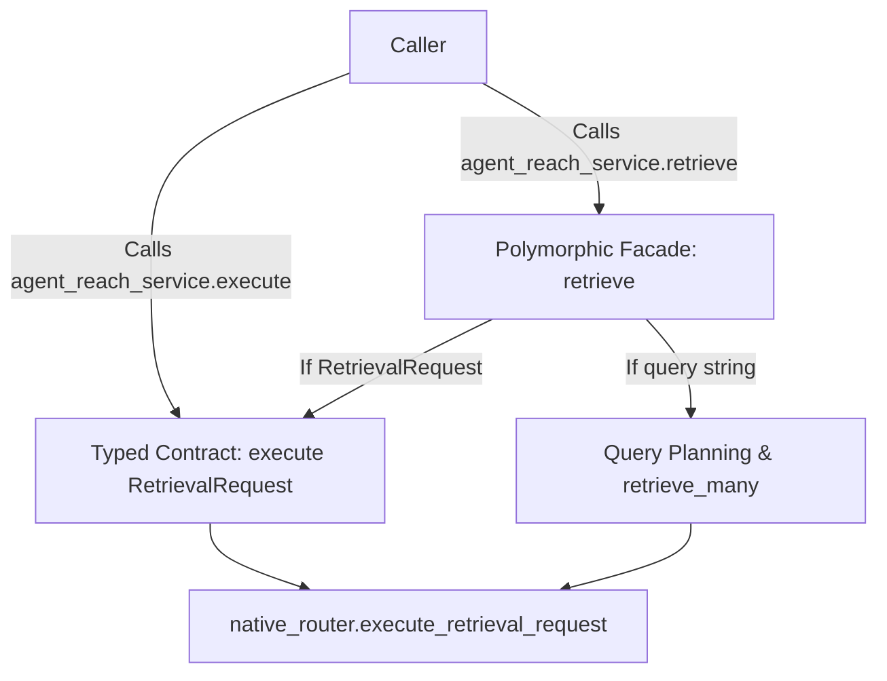

# Aegis Protocol — Comprehensive Codebase Inventory & Architecture Audit

**Status:** Authoritative Architectural Baseline (Phase 0)  
**Date:** October 9, 2026  
**Audited Commit:** `b441250f65c77256fad0dc222fc02ad55fdc9995`  
**Repository Scope:** `ShaunakRane914/Misinformation`, branch `feat/retrieval-quality-benchmark`

---

## 1. Executive Summary & Verification Taxonomy

This document provides a comprehensive inventory of all software packages, modules, entrypoints, and architectural dependencies across the **Aegis Protocol** repository.

Every finding in this inventory is classified under the strict verification taxonomy:
- **`[VERIFIED]`**: Confirmed through static code inspection, AST parsing, grep verification, and regression test execution.
- **`[LIKELY]`**: Strongly supported by existing code patterns and documentation traces, but pending runtime stress verification.
- **`[NEEDS_VALIDATION]`**: Requires live end-to-end network or external API credential testing.
- **`[SUPERSEDED]`**: An obsolete observation or claim from earlier audit documents that no longer applies to the current codebase.

### Key Inventory Metrics
- **Total Tracked Git Entries:** ~799 files (~51.4 MB tracked content).
- **Working Directory Physical Disk Usage:** ~450 MB (due to 338 MB uncommitted local research data, 31 MB visual audit screenshots, and 17.6 MB local SQLite database).
- **Total Python Modules Audited:** 114 `.py` files across `backend/`, `scrapers/`, `scripts/`, and `tests/`.
- **Measured Regression Test Baseline:** **528 passed tests** (Pytest 8.4.2 on Python 3.13.5).

---

## 2. Priority 0 Architectural Defect Audits

### 2.1 Duplicate Method Definition in `AgentReachService` `[VERIFIED]`
In [`backend/services/agent_reach/adapter.py`](file:///c:/Users/Shaunak%20Rane/Desktop/Projects/Misinformation/backend/services/agent_reach/adapter.py):
- **Line 190**: Defines `def retrieve(self, request_or_query: Any, **kwargs) -> RetrievalResult:`
  ```python
  if isinstance(request_or_query, RetrievalRequest):
      frags = self.execute(request_or_query)
      return RetrievalResult(...)
  return self.omni_scan(request_or_query, **kwargs)
  ```
- **Line 631**: Defines `def retrieve(self, query: str, domain: str = "general", channels: Optional[List[str]] = None, ...) -> RetrievalResult:`
  ```python
  clean_q = query.strip()
  plan = self.planner.plan(clean_q, domain=domain, include_channels=channels)
  ...
  ```

#### Call-Flow & Execution Analysis `[VERIFIED]`
Because line 631 appears after line 190 in the class body of `AgentReachService`, Python binds only the second definition. The earlier method at line 190 is **silently shadowed and dead**.

Inspection of all active callers across the repository revealed:
1. **Domain Agents (`scout_agent.py`, `trending_agent.py`, `scout/engine.py`)**:
   - They **never call `retrieve()`**. Instead, they directly call `agent_reach_service.execute(request: RetrievalRequest) -> List[EvidenceFragment]`.
2. **Test Suites & Legacy API (`test_agent_reach_service.py:136`, `test_agent_reach_chaos.py:37, 111`, `adapter.py:872`)**:
   - All call the keyword-based string interface: `service.retrieve(query="...", domain="...", channels=[...])`.
   - If any caller had passed a `RetrievalRequest` object to `retrieve()`, it would have crashed immediately with `AttributeError: 'RetrievalRequest' object has no attribute 'strip'` at line 644.
3. **Resolution Contract**:
   Reconcile `retrieve()` into a single polymorphic method that accepts either `request: RetrievalRequest` or `(query: str, domain: str = "general", ...)` and eliminates the duplicate definition cleanly.



---

### 2.2 Docker Build Context Secret & Artifact Leakage `[VERIFIED]`
In [`Dockerfile`](file:///c:/Users/Shaunak%20Rane/Desktop/Projects/Misinformation/Dockerfile):
- Line 39 contains `COPY --chown=aegis:aegis . /app`.
- In commit `b441250`, there was **no `.dockerignore` file**.
- **Impact**: Any local `.env` file containing production Supabase service roles, Gemini keys, or Apify tokens would be copied into the container image layers. Furthermore, `research/` (338 MB), `docs/visual-audit/` (31 MB), `aegis_local.db` (17.6 MB), and `venv/` (309 MB) bloated the container build context to >700 MB.
- **Remediation Implemented**: Created authoritative root [`.dockerignore`](file:///c:/Users/Shaunak%20Rane/Desktop/Projects/Misinformation/.dockerignore) excluding secrets, caches, and test/research bulk assets.

---

### 2.3 Monolithic Acquisition Router (`router.py`) `[VERIFIED]`
[`backend/services/agent_reach/native/router.py`](file:///c:/Users/Shaunak%20Rane/Desktop/Projects/Misinformation/backend/services/agent_reach/native/router.py) is **1,706 lines long**.
It combines:
1. In-memory social caching (`_get_social_cache`, `_set_social_cache`).
2. Arctic Shift Reddit API client (`_fetch_arctic_shift_posts_batch`, `_fetch_arctic_shift_search`, lines 125–290).
3. FxTwitter API client (`_fetch_fxtwitter_status`, `_fetch_fxtwitter_profile`, lines 291–374).
4. `execute_channel_query` (lines 405–1068, **663 lines in a single method**).
5. Direct Jina Reader HTTP fetching (`execute_channel_read`, lines 1069–1222).
6. Web and Yahoo search clients (`_execute_web_search`, `_execute_yahoo_search`, lines 1223–1345).
7. Legacy scraper fallback invocation (`_fallback_*`, lines 1346–1446).
8. Candidate search discovery and concurrent execution (`execute_retrieval_request`, lines 1447–1707).

*Architectural Problem*: Despite the existence of [`backend/services/agent_reach/native/adapters/`](file:///c:/Users/Shaunak%20Rane/Desktop/Projects/Misinformation/backend/services/agent_reach/native/adapters/), `router.py` reimplements platform logic directly, bypassing the adapter abstraction.

---

## 3. Codebase Package & Module Inventory

### 3.1 Agent Layer (`backend/agents/`)

| Module | Lines | Role | Primary Classes & Entrypoints | Dependencies & Side Effects | Test Coverage |
| :--- | :---: | :--- | :--- | :--- | :--- |
| [`brandshield_agent.py`](file:///c:/Users/Shaunak%20Rane/Desktop/Projects/Misinformation/backend/agents/brandshield_agent.py) | 1,120 | **Production** | `BrandShieldAgent`, `scan_brand()` | `agent_reach_service`, `entity_resolver`, Gemini, Supabase | [`tests/unit/test_brandshield_agent.py`](file:///c:/Users/Shaunak%20Rane/Desktop/Projects/Misinformation/tests/unit/test_brandshield_agent.py) |
| [`trending_agent.py`](file:///c:/Users/Shaunak%20Rane/Desktop/Projects/Misinformation/backend/agents/trending_agent.py) | 1,283 | **Production** | `TrendingAgent`, `scan_trends()`, `verify_velocity()` | `agent_reach_service`, `temporal_guard`, Hawkes process, Supabase | [`tests/unit/test_trending_agent.py`](file:///c:/Users/Shaunak%20Rane/Desktop/Projects/Misinformation/tests/unit/test_trending_agent.py), [`tests/test_trending_temporal_guard.py`](file:///c:/Users/Shaunak%20Rane/Desktop/Projects/Misinformation/tests/test_trending_temporal_guard.py) |
| [`scout_agent.py`](file:///c:/Users/Shaunak%20Rane/Desktop/Projects/Misinformation/backend/agents/scout_agent.py) | 1,202 | **Production** | `ScoutAgent`, `scan_financial_threats()` | `scout_source_engine`, `agent_reach_service`, YFinance API, Supabase | [`tests/unit/test_scout_agent.py`](file:///c:/Users/Shaunak%20Rane/Desktop/Projects/Misinformation/tests/unit/test_scout_agent.py), [`tests/unit/test_scout_source_engine.py`](file:///c:/Users/Shaunak%20Rane/Desktop/Projects/Misinformation/tests/unit/test_scout_source_engine.py) |
| [`personal_agent.py`](file:///c:/Users/Shaunak%20Rane/Desktop/Projects/Misinformation/backend/agents/personal_agent.py) | 1,353 | **Production** | `PersonalWatchAgent`, `scan_vip()` | `agent_reach_service`, `entity_resolver`, Gemini, Supabase | [`tests/unit/test_personal_agent.py`](file:///c:/Users/Shaunak%20Rane/Desktop/Projects/Misinformation/tests/unit/test_personal_agent.py) |
| [`claim_ingestion_agent.py`](file:///c:/Users/Shaunak%20Rane/Desktop/Projects/Misinformation/backend/agents/claim_ingestion_agent.py) | 175 | **Production** | `ClaimIngestionAgent`, `ingest_claim()` | `database.py`, Unicode normalization | [`tests/unit/test_claim_ingestion.py`](file:///c:/Users/Shaunak%20Rane/Desktop/Projects/Misinformation/tests/unit/test_claim_ingestion.py) |
| [`coordinator_agent.py`](file:///c:/Users/Shaunak%20Rane/Desktop/Projects/Misinformation/backend/agents/coordinator_agent.py) | 646 | **Production** | `CoordinatorAgent`, `coordinate_response()` | All domain agents, Threat Lab consensus | [`tests/unit/test_coordinator_agent.py`](file:///c:/Users/Shaunak%20Rane/Desktop/Projects/Misinformation/tests/unit/test_coordinator_agent.py) |

---

### 3.2 Shared Acquisition Layer (`backend/services/agent_reach/`)

| Module | Lines | Role | Primary Classes & Entrypoints | Dependencies & Issues | Test Coverage |
| :--- | :---: | :--- | :--- | :--- | :--- |
| [`native/router.py`](file:///c:/Users/Shaunak%20Rane/Desktop/Projects/Misinformation/backend/services/agent_reach/native/router.py) | 1,706 | **Production** | `NativeRouter`, `execute_retrieval_request()` | Monolithic router; direct HTTP requests to Arctic Shift & FxTwitter | [`tests/chaos/test_agent_reach_chaos.py`](file:///c:/Users/Shaunak%20Rane/Desktop/Projects/Misinformation/tests/chaos/test_agent_reach_chaos.py) |
| [`adapter.py`](file:///c:/Users/Shaunak%20Rane/Desktop/Projects/Misinformation/backend/services/agent_reach/adapter.py) | 926 | **Production** | `AgentReachService`, `execute()`, `retrieve()`, `retrieve_many()` | Duplicate `retrieve` method definition (lines 190 and 631) | [`tests/unit/test_agent_reach_service.py`](file:///c:/Users/Shaunak%20Rane/Desktop/Projects/Misinformation/tests/unit/test_agent_reach_service.py) |
| [`channels.py`](file:///c:/Users/Shaunak%20Rane/Desktop/Projects/Misinformation/backend/services/agent_reach/channels.py) | 849 | **Production** | `EvidenceFragment`, `RetrievalRequest`, `CandidateSource` | Core acquisition data contracts; typed Pydantic models | [`tests/unit/test_shared_acquisition_fabric.py`](file:///c:/Users/Shaunak%20Rane/Desktop/Projects/Misinformation/tests/unit/test_shared_acquisition_fabric.py) |
| [`channels_impl.py`](file:///c:/Users/Shaunak%20Rane/Desktop/Projects/Misinformation/backend/services/agent_reach/channels_impl.py) | 322 | **Production** | `Channel`, `SearchChannel`, `WebSearchChannel` | Platform wrappers around native router calls | [`tests/unit/test_shared_acquisition_fabric.py`](file:///c:/Users/Shaunak%20Rane/Desktop/Projects/Misinformation/tests/unit/test_shared_acquisition_fabric.py) |
| [`planner.py`](file:///c:/Users/Shaunak%20Rane/Desktop/Projects/Misinformation/backend/services/agent_reach/planner.py) | 789 | **Production** | `RetrievalPlanner`, `build_multi_channel_queries()` | Query expansion rules, domain query classes | [`tests/unit/test_agent_reach_planner.py`](file:///c:/Users/Shaunak%20Rane/Desktop/Projects/Misinformation/tests/unit/test_agent_reach_planner.py) |
| [`profile.py`](file:///c:/Users/Shaunak%20Rane/Desktop/Projects/Misinformation/backend/services/agent_reach/profile.py) | 605 | **Production** | `AgentReachProfile`, `ChannelCapability` | Static channel configuration matrix and rate limits | [`tests/unit/test_agent_reach_profile.py`](file:///c:/Users/Shaunak%20Rane/Desktop/Projects/Misinformation/tests/unit/test_agent_reach_profile.py) |
| [`registry.py`](file:///c:/Users/Shaunak%20Rane/Desktop/Projects/Misinformation/backend/services/agent_reach/registry.py) | 204 | **Production** | `CapabilityRegistry` | Channel availability state and health tracking | [`tests/unit/test_agent_reach_service.py`](file:///c:/Users/Shaunak%20Rane/Desktop/Projects/Misinformation/tests/unit/test_agent_reach_service.py) |
| [`extraction/*`](file:///c:/Users/Shaunak%20Rane/Desktop/Projects/Misinformation/backend/services/agent_reach/extraction/) | 1,093 | **Misplaced** | `BrandShieldExtractor`, `TrendingExtractor`, `ScoutExtractor`, `PersonalExtractor` | **Architectural Leak**: Domain agent extraction logic embedded in shared acquisition fabric | Covered by agent tests |
| [`scout/*`](file:///c:/Users/Shaunak%20Rane/Desktop/Projects/Misinformation/backend/services/agent_reach/scout/) | 2,106 | **Misplaced** | `ScoutSourceEngine`, `ScoutDiscovery`, `ScoutRanking` | **Architectural Leak**: Full financial sub-agent framework embedded in shared acquisition service | [`tests/unit/test_scout_source_engine.py`](file:///c:/Users/Shaunak%20Rane/Desktop/Projects/Misinformation/tests/unit/test_scout_source_engine.py) |
| [`agent_reach_scraper.py`](file:///c:/Users/Shaunak%20Rane/Desktop/Projects/Misinformation/backend/services/agent_reach_scraper.py) | 686 | **Compatibility**| `AgentReachScraper`, `reach_scraper` | Legacy scraping fallback using BeautifulSoup & raw requests | [`tests/unit/test_scraper_fallback.py`](file:///c:/Users/Shaunak%20Rane/Desktop/Projects/Misinformation/tests/unit/test_scraper_fallback.py) |

---

### 3.3 Research Engine & Evaluation Layer (`backend/services/research/`)

| Module | Lines | Role | Primary Classes & Entrypoints | Dependencies & Invariants | Test Coverage |
| :--- | :---: | :--- | :--- | :--- | :--- |
| [`research_engine.py`](file:///c:/Users/Shaunak%20Rane/Desktop/Projects/Misinformation/backend/services/research/research_engine.py) | 755 | **Production** | `ResearchEngine`, `investigate()` | Single 581-line `investigate()` method; coordinates 10 funnel stages | [`tests/integration/test_claim_pipeline.py`](file:///c:/Users/Shaunak%20Rane/Desktop/Projects/Misinformation/tests/integration/test_claim_pipeline.py) |
| [`research_models.py`](file:///c:/Users/Shaunak%20Rane/Desktop/Projects/Misinformation/backend/services/research/research_models.py) | 623 | **Production** | `EvidenceItem`, `Finding`, `TruthDossier`, `QualityTensor` | Core 6-verdict epistemic taxonomy and quality tensors | Contract tests |
| [`temporal_guard.py`](file:///c:/Users/Shaunak%20Rane/Desktop/Projects/Misinformation/backend/services/research/temporal_guard.py) | 510 | **Production** | `TemporalGuard`, `evaluate()` | 48-hour freshness window; decouples $T_{pub}$ from $T_{disc}$ | [`tests/test_trending_temporal_guard.py`](file:///c:/Users/Shaunak%20Rane/Desktop/Projects/Misinformation/tests/test_trending_temporal_guard.py) (10/10 passing) |
| [`entity_resolver.py`](file:///c:/Users/Shaunak%20Rane/Desktop/Projects/Misinformation/backend/services/research/entity_resolver.py) | 473 | **Production** | `EntityResolver`, `evaluate_entity_match()` | Disambiguates named entities; rejects homographs & action verbs | [`tests/test_retrieval_quality_hardening.py`](file:///c:/Users/Shaunak%20Rane/Desktop/Projects/Misinformation/tests/test_retrieval_quality_hardening.py) |
| [`relevance_gate.py`](file:///c:/Users/Shaunak%20Rane/Desktop/Projects/Misinformation/backend/services/research/relevance_gate.py) | 348 | **Production** | `RelevanceGate`, `evaluate_item()` | Deterministic hard gates; orthogonal entity, intent, quality scoring | [`tests/test_retrieval_benchmark.py`](file:///c:/Users/Shaunak%20Rane/Desktop/Projects/Misinformation/tests/test_retrieval_benchmark.py) |
| [`retrieval_metrics.py`](file:///c:/Users/Shaunak%20Rane/Desktop/Projects/Misinformation/backend/services/research/retrieval_metrics.py) | 417 | **Evaluation** | `evaluate_ranking_run()`, `aggregate_metrics()` | Cranfield retrieval metrics: Success@k, P@k, Recall@k, MRR, nDCG | [`tests/test_retrieval_metrics.py`](file:///c:/Users/Shaunak%20Rane/Desktop/Projects/Misinformation/tests/test_retrieval_metrics.py) (10/10 passing) |
| [`semantic_reranker.py`](file:///c:/Users/Shaunak%20Rane/Desktop/Projects/Misinformation/backend/services/research/semantic_reranker.py) | 268 | **Experimental**| `SemanticReranker`, `rerank()` | Second-stage CrossEncoder; **disabled in production (`AEGIS_SEMANTIC_RERANKER=0`)** | [`tests/test_semantic_reranker.py`](file:///c:/Users/Shaunak%20Rane/Desktop/Projects/Misinformation/tests/test_semantic_reranker.py) |
| [`replay_ledger.py`](file:///c:/Users/Shaunak%20Rane/Desktop/Projects/Misinformation/backend/services/research/replay_ledger.py) | 434 | **Production** | `ReplayLedger`, `record_event()` | Cryptographic SHA-256 hash chains for forensic research replay | [`tests/unit/test_replay_ledger.py`](file:///c:/Users/Shaunak%20Rane/Desktop/Projects/Misinformation/tests/unit/test_replay_ledger.py) |
| [`audit_lineage_validator.py`](file:///c:/Users/Shaunak%20Rane/Desktop/Projects/Misinformation/backend/services/research/audit_lineage_validator.py) | 322 | **Production** | `AuditLineageValidator` | Invariants A–H enforcement; DAG acyclicity checks | [`tests/test_complete_retrieval_audit_integrity.py`](file:///c:/Users/Shaunak%20Rane/Desktop/Projects/Misinformation/tests/test_complete_retrieval_audit_integrity.py) |

---

### 3.4 API & Routing Layer (`backend/api/` & `backend/main.py`)

| Module | Lines | Role | Primary Routes & Endpoints | Status / Observations |
| :--- | :---: | :--- | :--- | :--- |
| [`backend/main.py`](file:///c:/Users/Shaunak%20Rane/Desktop/Projects/Misinformation/backend/main.py) | 308 | **Production** | App factory, CORS, static mounting, health check | **Refactored**: Down from >2,100 lines to 308 lines; delegates to routers |
| [`api/claims.py`](file:///c:/Users/Shaunak%20Rane/Desktop/Projects/Misinformation/backend/api/claims.py) | 696 | **Production** | `POST /api/claims`, `GET /api/claims/{id}` | Claim ingestion, research triggering, dossier serialization |
| [`api/agents.py`](file:///c:/Users/Shaunak%20Rane/Desktop/Projects/Misinformation/backend/api/agents.py) | 446 | **Production** | `/api/agents/{agent_name}/scan` | Domain sentinel scan triggers (BrandShield, Trending, Scout, Personal) |
| [`api/system.py`](file:///c:/Users/Shaunak%20Rane/Desktop/Projects/Misinformation/backend/api/system.py) | 381 | **Production** | `/api/healthz`, `/api/system/capabilities`, Doctor | System telemetry, channel health checks, readiness probes |
| [`api/agent_reach.py`](file:///c:/Users/Shaunak%20Rane/Desktop/Projects/Misinformation/backend/api/agent_reach.py) | 308 | **Production** | `POST /api/agent-reach/retrieve`, `POST /api/agent-reach/read` | Public acquisition REST API |
| [`api/threat_lab.py`](file:///c:/Users/Shaunak%20Rane/Desktop/Projects/Misinformation/backend/api/threat_lab.py) | 215 | **Production** | `/api/threat-lab/simulate`, Hawkes, Mandelbrot | Mathematical physics simulations for narrative volatility |
| [`api/replay.py`](file:///c:/Users/Shaunak%20Rane/Desktop/Projects/Misinformation/backend/api/replay.py) | 68 | **Production** | `/api/replay/{claim_id}` | Forensic dossier replay and ledger verification |

---

### 3.5 Infrastructure, LLM & Persistence Layers

| Module | Lines | Role | Responsibility | Issues & Observations |
| :--- | :---: | :--- | :--- | :--- |
| [`backend/config.py`](file:///c:/Users/Shaunak%20Rane/Desktop/Projects/Misinformation/backend/config.py) | 76 | **Production** | `Config` class | Reads `os.getenv` without Pydantic validation schema |
| [`backend/services/gemini_service.py`](file:///c:/Users/Shaunak%20Rane/Desktop/Projects/Misinformation/backend/services/gemini_service.py) | 379 | **Production** | `GeminiService` | Key rotation, exponential backoff, mock mode when key is absent |
| [`backend/services/intelligence.py`](file:///c:/Users/Shaunak%20Rane/Desktop/Projects/Misinformation/backend/services/intelligence.py) | 189 | **Production** | Synthesis helpers | Prompts for narrative decomposition and stance classification |
| [`backend/db/database.py`](file:///c:/Users/Shaunak%20Rane/Desktop/Projects/Misinformation/backend/db/database.py) | 527 | **Production** | `DatabaseClient`, SQLite / Supabase | Dual-database persistence: Supabase cloud with automatic SQLite fallback (`aegis_local.db`) |

---

## 4. File-Retention & Data Governance Inventory

| Directory / File Category | Tracked Size | Disk Size | File Count | Classification | Retention Policy |
| :--- | :---: | :---: | :---: | :--- | :--- |
| **`tests/retrieval_benchmark/`** | 338 KB | 338 KB | 3 files | **Frozen Golden Fixture** | **Keep in Source**: Bit-for-bit identical golden dataset (`scenarios.jsonl`, `candidates.jsonl`, `labels.jsonl`). |
| **`artifacts/live_retrieval_evaluation/`** | 1.1 MB | 1.1 MB | 7 files | **Authoritative Evaluation Deliverables** | **Keep in Source / Artifacts**: Authoritative report, frozen pool, adjudication template, rankings, failures. |
| **`docs/visual-audit/`** | 30.99 MB | 30.99 MB | 54 PNGs | **Media Asset Archive** | **Candidate for Release Assets / External Archive**: Move to release assets; exclude from Docker (`.dockerignore`). |
| **`research/`** | 9.1 MB | 338.3 MB | 250+ files | **Historical Research Experiment Data** | **Local / Archive with Manifest**: Raw dumps, PDFs, and scratchpads excluded from git and Docker. |
| **`aegis_local.db`** | 0 MB (ignored) | 17.6 MB | 1 SQLite file | **Local Runtime State** | **Git & Docker Ignored**: Local SQLite database strictly excluded from container builds. |
| **`docs/audit/`** | ~35 KB | ~35 KB | 8 files | **Historical Audit Records** | **Archive**: Mark stale audit files (`ARCHITECTURE_REVIEW.md`, `IMPROVEMENT_PLAN.md`) as `[SUPERSEDED]`. |

---

## 5. Architectural Anti-Patterns & Risk Catalog

1. **`[VERIFIED]` Duplicate Method Shadowing in `AgentReachService`**: Lines 190 and 631 of `adapter.py` define `retrieve`. The second definition shadows the first.
2. **`[VERIFIED]` Misplaced Domain Extraction Logic**: `backend/services/agent_reach/extraction/` and `backend/services/agent_reach/scout/` place domain-specific agent logic inside the generic acquisition service.
3. **`[VERIFIED]` Single-Method Inlining in `ResearchEngine`**: `investigate()` is 581 lines long, implementing all 10 stages of research sequentially rather than using composable pipeline stages.
4. **`[VERIFIED]` Stale Documentation Claims**:
   - `docs/audit/ARCHITECTURE_REVIEW.md:43` claims `backend/main.py` is over 2,100 lines (`[SUPERSEDED]` — it is 308 lines).
   - `README.md` and `docs/TESTING.md` claim 180 tests (`[SUPERSEDED]` — actual measured count is 528 passing tests).
5. **`[VERIFIED]` Incomplete CI Test Matrix**: `.github/workflows/ci.yml` runs only `tests/unit/`, `tests/chaos/`, `tests/security/`, skipping all root-level benchmark, temporal guard, and audit integrity tests.
6. **`[VERIFIED]` Unpinned Dependency Specification**: `requirements.txt` specifies open-ended `>=` versions and lacks `pyproject.toml` or a committed lockfile.
