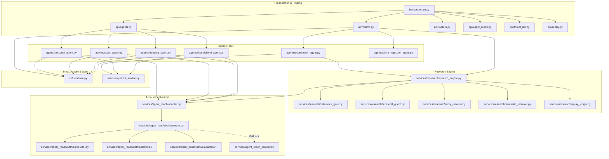

# Aegis Protocol — Cross-Module Dependency Map & Import Graph

**Status:** Authoritative Import & Coupling Audit (Phase 0)  
**Date:** October 9, 2026  
**Audited Commit:** `b441250f65c77256fad0dc222fc02ad55fdc9995`  
**Repository Scope:** `ShaunakRane914/Misinformation`

---

## 1. Import Topology & Coupling Analysis

This document maps all inter-module dependencies across the Aegis Protocol codebase to identify cyclic dependencies, hidden side effects, private attribute leaks, and transition migration requirements.



---

## 2. Identified Coupling Anti-Patterns & Code Smells

### 2.1 Private Attribute Access Across Module Boundaries `[VERIFIED]`
Multiple modules bypass public interfaces and directly manipulate private instance variables:
1. **`tests/unit/test_agent_reach_service.py:131-134`**:
   - Accesses and mutates `service.registry._channels["reddit"]` and `service.registry._status["news"]`.
   - *Fix*: Expose explicit testing helpers `registry.set_channel_mock()` and `registry.set_status()`.
2. **`tests/chaos/test_agent_reach_chaos.py:106-109`**:
   - Directly patches internal `channel.search` methods across private channels.
   - *Fix*: Provide an official `ChaosInjectionHarness` on the capability registry.
3. **`backend/services/agent_reach/native/router.py:94`**:
   - Directly uses `self._social_cache` dictionary rather than delegating to `native.cache.social_cache`.
   - *Fix*: Centralize all caching in `infrastructure/acquisition/cache.py`.

---

### 2.2 Alternate and Competing Import Paths `[VERIFIED]`
Inconsistencies exist in how modules import shared services:
1. **Full Module Paths vs Root Package Paths**:
   - Some files import `from backend.services.research import research_engine`.
   - Other files import `from backend.services.research.research_engine import research_engine`.
2. **Scout Framework Duplication**:
   - `backend/agents/scout_agent.py` imports `scout_source_engine` from `backend.services.agent_reach.scout.engine`.
   - But `backend.services.agent_reach.scout.engine` in turn imports `agent_reach_service` from `backend.services.agent_reach.adapter`.
   - This forms a conceptual circular loop: Agent $\to$ Acquisition $\to$ Scout Sub-engine $\to$ Acquisition $\to$ Router!

---

### 2.3 Shared Singleton State Inventory `[VERIFIED]`
The codebase relies heavily on global singleton instances:

| Singleton Name | Defined In | Exported To | Thread Safety / Mutation Risk |
| :--- | :--- | :--- | :--- |
| `agent_reach_service` | `backend/services/agent_reach/adapter.py` | All domain agents, `research_engine.py`, API endpoints | Mutates internal `CapabilityRegistry` health status. |
| `native_router` | `backend/services/agent_reach/native/router.py` | `adapter.py` | Mutates in-memory `_social_cache`. |
| `native_doctor` | `backend/services/agent_reach/native/doctor.py` | `native/router.py`, `api/system.py` | Executes live upstream health probes and stores health timestamps. |
| `reach_scraper` | `backend/services/agent_reach_scraper.py` | `native/router.py` (legacy fallback) | Modifies per-request session headers. |
| `relevance_gate` | `backend/services/research/relevance_gate.py` | `research_engine.py`, benchmark harness | Immutable configuration; safe. |
| `temporal_guard` | `backend/services/research/temporal_guard.py` | `trending_agent.py`, `relevance_gate.py` | Immutable reference time; safe. |
| `db` | `backend/db/database.py` | All agents, `api/claims.py` | Opens SQLite connection or Supabase HTTP client pool. |
| `gemini_service` | `backend/services/gemini_service.py` | `brandshield_agent.py`, `personal_agent.py` | Mutates `_active_key_index` for key rotation. |

*Architectural Recommendation*: In Phase 6, replace loose module-level singletons with FastAPI dependency injection (`Depends(get_agent_reach_service)`) or explicit factory functions to prevent cross-test state leakage.

---

### 2.4 Import-Time Side Effects & Broad Fallback Masks `[VERIFIED]`
1. **Database Client Initialization at Import Time**:
   - In [`backend/db/database.py`](file:///c:/Users/Shaunak%20Rane/Desktop/Projects/Misinformation/backend/db/database.py), creating `DatabaseClient` runs SQLite schema initialization (`CREATE TABLE IF NOT EXISTS`) and connects to Supabase at module import time.
   - *Impact*: Importing `backend.db.database` in unit tests triggers local file system I/O (`aegis_local.db`).
   - *Fix*: Defer connection and table creation to application lifespan or explicit initialization hooks.
2. **Broad Exception Masks**:
   - `backend/services/agent_reach/native/router.py` contains 14 instances of `except Exception as e:` that log a warning and return empty lists `[]`.
   - *Risk*: Masks underlying syntax errors, import errors, or connection bugs during development.

---

## 3. Phased Compatibility Transition Roadmap

To refactor the repository safely without breaking existing endpoints or test suites, we will maintain backwards-compatible import shims during Phases 1–6:

```
[Phase 1-2]: Preserve all existing import paths.
[Phase 3]:   Refactor acquisition.
             Keep 'backend/services/agent_reach/adapter.py' as a re-exporting shim:
             from backend.infrastructure.acquisition.service import agent_reach_service
[Phase 4]:   Refactor research engine.
             Keep 'backend/services/research/research_engine.py' as a re-exporting shim:
             from backend.application.research.pipeline import research_engine
[Phase 5]:   Decompose domain agents.
             Keep 'backend/agents/brandshield_agent.py' as a re-exporting shim:
             from backend.agents.brandshield import BrandShieldAgent
[Phase 6]:   Centralize LLM & DB persistence.
             Keep 'backend/services/gemini_service.py' as a shim to 'infrastructure/llm/'.
[Phase 7]:   Audit all call sites, remove deprecated shims, and lock imports.
```
