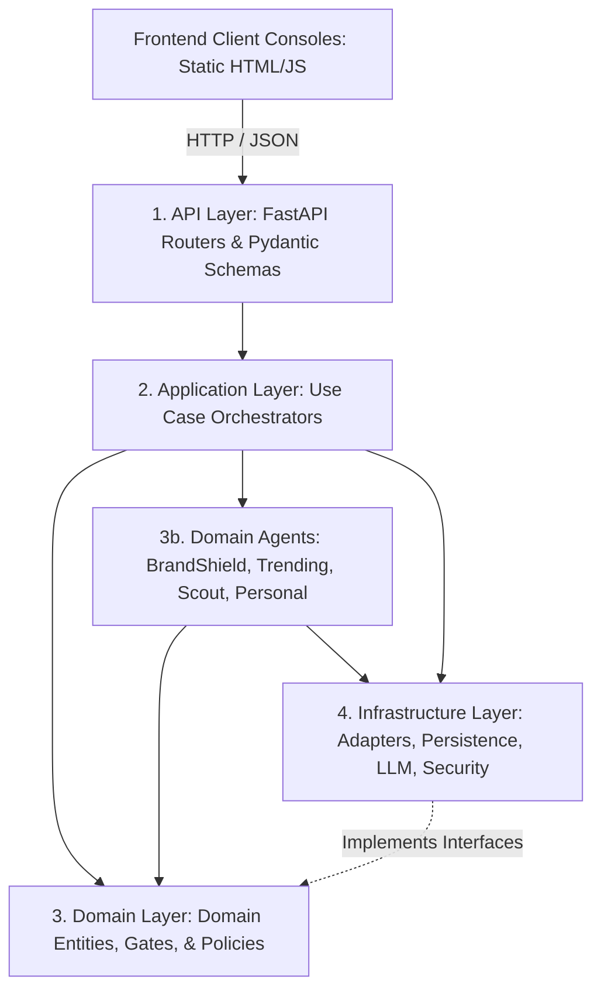

# ADR 0001: Modular Monolith Layering & Architectural Boundaries

## Status
**ACCEPTED**

## Date
2026-10-09

## Deciders
- Principal Software Architect & Migration Lead
- Aegis Protocol Core Engineering Team

---

## 1. Context and Problem Statement
Aegis Protocol has grown organically from an initial fact-checking prototype into an enterprise-grade intelligence platform featuring four specialized autonomous agents (BrandShield, Trending, Scout, Personal Watch), a physics-based threat lab, a shared research engine, and multi-channel internet acquisition.

However, several architectural layers have accumulated tangled, overlapping responsibilities:
- Domain agents contain low-level HTTP requests and scraping logic alongside high-level threat assessment.
- Infrastructure adapters contain domain-specific threat classification (e.g. `backend/services/agent_reach/extraction/` and `scout/`).
- Shared acquisition (`router.py`) spans 1,706 lines mixing dispatch, provider scraping, social caching, and content extraction.
- Cross-layer imports occur without enforced directional boundaries, risking cyclic imports and tight coupling.

We need an explicit architectural topology that provides long-term maintainability, independent testability, and upgrade safety without introducing the operational overhead, network serialization latency, and deployment complexity of distributed microservices.

---

## 2. Decision Drivers
1. **Maintainability & Modularity**: Changes to one agent or channel adapter must not cause cascading breakages across unrelated components.
2. **Single Deployable Unit**: Aegis must remain deployable as a cohesive, lightweight container without requiring Kubernetes orchestration or service meshes.
3. **Deterministic Testing**: Every layer must be testable in complete isolation with deterministic mocks.
4. **Contract Preservation**: Public REST API endpoints and response schemas must remain strictly backwards-compatible.
5. **No Needless Frontend Churn**: The performant Vanilla HTML/CSS/JS frontend dashboards must be preserved without rewriting them into heavy SPA frameworks.

---

## 3. Considered Alternatives
- **Alternative 1: Microservices Fleet**. Decompose each agent (BrandShield, Trending, Scout, Personal Watch) and acquisition into independent containerized services communicating over gRPC/REST.
  - *Rejected*: Adds severe operational complexity, distributed transaction overhead, deployment friction, and network latency without adding user value.
- **Alternative 2: Unstructured Single-Directory Monolith**. Maintain the existing flat `backend/services/` and `backend/agents/` hierarchy with informal conventions.
  - *Rejected*: Has proven to cause file bloat (modules exceeding 1,700 lines), circular dependencies, and duplicate methods (e.g., `AgentReachService.retrieve` defined twice).
- **Alternative 3: Structured Modular Monolith (Chosen)**. Organize the codebase into explicit architectural layers (`api`, `application`, `domain`, `agents`, `infrastructure`, `evaluation`) with enforced unidirectional dependency flow within a single FastAPI application.

---

## 4. Decision Outcome
Chosen option: **Alternative 3 — Structured Modular Monolith**.

### 4.1 Four-Tier Layering Topology

### 4.2 Explicit Dependency Rules
1. **API Layer (`backend/api/`)**:
   - *May import*: `application/`, `domain/`, `core/`.
   - *Must NEVER import*: Raw platform scraping internals or direct database connections.
2. **Application Layer (`backend/application/`)**:
   - *May import*: `domain/`, `agents/`, `infrastructure/contracts.py`, `core/`.
   - *Must NEVER import*: FastAPI request/response objects directly.
3. **Domain Layer (`backend/domain/`)**:
   - *May import*: Standard library, `pydantic` dataclasses/models, `core/errors.py`.
   - *Must NEVER import*: Network libraries (`requests`, `httpx`, `aiohttp`), external database drivers (`supabase`), or infrastructure adapters.
4. **Domain Agents (`backend/agents/`)**:
   - *May import*: `domain/`, `infrastructure/contracts.py`, `core/`.
   - *Must NEVER import*: Private adapter internals or rival domain agent packages.
5. **Infrastructure Layer (`backend/infrastructure/`)**:
   - *May import*: External packages (`requests`, `bs4`, `supabase`, `sentence_transformers`), `domain/`, `core/`.
   - Implements ports/contracts defined by domain and application layers.

---

## 5. Consequences

### Positive Consequences
- **Clear Code Ownership**: Each package has a single well-defined responsibility.
- **Fast Test Execution**: Unit tests can run against pure domain logic in milliseconds without database or network setup.
- **Safer Upgrades**: Upgrading upstream scraping tools (e.g. Agent Reach upstream) is isolated to `infrastructure/acquisition/adapters/`.
- **Preserved Deployment Simplicity**: The entire application starts via a single `uvicorn backend.main:app` command.

### Negative Consequences / Trade-offs
- Requires staged refactoring to avoid breaking active import paths (mitigated by temporary compatibility import shims during Phases 1–6).
