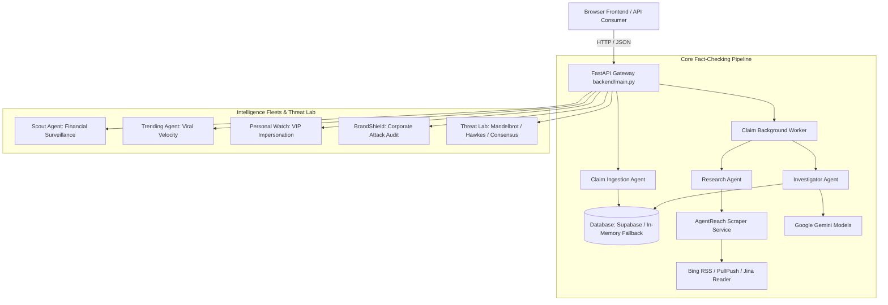

# Aegis Protocol — Architecture Review
**Audit Date**: September 21, 2026

---

## 1. System Topology & Data Flow

---

## 2. Architectural Findings & Trade-Offs

### 2.1 Monolithic `main.py`
`backend/main.py` is over 2,100 lines long, housing route definitions, request validation, Threat Lab simulation logic, and database access.
- **Risk**: High coupling, difficult regression testing, and duplicate logic across routes.
- **Refactoring Strategy**: Keep public route contracts stable, but extract business logic and validation helpers into dedicated services and clean domain models.

### 2.2 Duplicated LLM Client Logic
`ResearchAgent`, `InvestigatorAgent`, `CoordinatorAgent`, and `main.py` all implement their own loop over `os.environ` keys and raw `requests.post()` calls to Gemini.
- **Risk**: Rate limits on one agent do not coordinate with others; model fallbacks are duplicated and error-prone; cannot inject deterministic mock providers during offline testing.
- **Architectural Solution**: Create a centralized `GeminiClient` in `backend/services/gemini_service.py` with exponential backoff, jitter, unified key rotation, and a `MockGeminiProvider` for deterministic offline testing.

### 2.3 Blocking Synchronous Operations in Async Endpoints
Several `async def` route handlers in `backend/main.py` execute blocking network I/O (`requests.get`, `requests.post`, `feedparser.parse`) directly on the event loop.
- **Risk**: Starves FastAPI's asyncio event loop, causing high latency spikes and timeout cascades during concurrent requests.
- **Solution**: Run blocking network calls in `asyncio.to_thread` or utilize `httpx.AsyncClient`.

### 2.4 Separation of Concerns in Threat Lab
Threat Lab instruments (Mandelbrot, Hawkes, Consensus) are embedded directly within route handlers in `backend/main.py`.
- **Solution**: Extract core algorithms into `backend/services/threat_instruments.py` so they can be unit-tested in isolation with mathematical edge cases.
